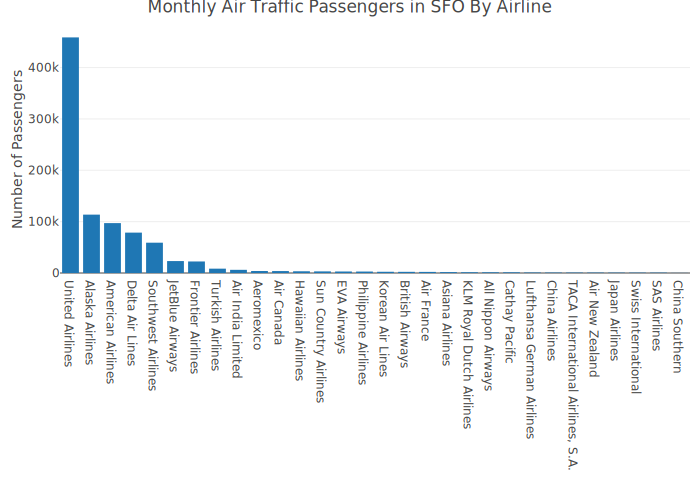

<!-- README.md is generated from README.Rmd. Please edit that file -->

```{r, include = FALSE}
knitr::opts_chunk$set(
  fig.height=5, fig.width=8, 
  message=FALSE, warning=FALSE,
  collapse = TRUE,
  comment = "#>",
  fig.path = "man/figures/README-",
  out.width = "100%"
)
```

# sfo

```{r, include=FALSE}
library(plotly)
library(dplyr)
library(sfo)
p <- sfo_passengers %>%
  group_by(activity_period) %>%
  summarise(total = sum(passenger_count), .groups = "drop") %>%
  mutate(date = as.Date(paste(substr(activity_period, 1, 4), 
                              substr(activity_period, 5, 6), "01", sep = "/"))) %>%
  plot_ly(x = ~ date, y = ~ total,
          type = "scatter", 
          mode = "lines") %>%
  layout(title = "Monthly Air Traffic Passengers in SFO",
         yaxis = list(title = "Number of Passengers"),
         xaxis = list(title = "Source: San Francisco data portal (DataSF)"))

orca(p, "man/figures/total.svg")  
```

<!-- badges: start -->

[](https://cran.r-project.org/package=sfo) [](https://www.tidyverse.org/lifecycle/#experimental) [](https://opensource.org/licenses/MIT) [](https://github.com/RamiKrispin/sfo/commit/main)

<!-- badges: end -->

The **sfo** package provides summary of the monthly passengers in San Francisco International Airport (SFO).

Data source: San Francisco data portal (DataSF) [API](https://data.sfgov.org/Transportation/Air-Traffic-Passenger-Statistics/rkru-6vcg)


## Installation

WIP still not available in CRAN but can be installed from Github:

``` r
# install.packages("devtools")
devtools::install_github("RamiKrispin/sfo", ref = "main")
```

## Usage

The `sfo_passengers` dataset provides a monthly summary of the number of passengers in SFO airport by different categories (such as terminal, geo, type, etc.):

```{r example}
library(sfo)

data("sfo_passengers")

head(sfo_passengers)
```

Below are some use cases of the package.

### Total number of passngers

The total number of passengers in most recent month by `activity_type_code` and `geo_region`:

```{r }
library(dplyr)

sfo_passengers %>%
  filter(activity_period == max(activity_period)) %>%
  group_by(activity_type_code, geo_region) %>%
  summarise(total = sum(passenger_count), .groups = "drop")
```

Likewise, we can summarize the total number of passengers in most recent month by airline:

``` r
library(plotly)

sfo_passengers %>%
  filter(activity_period == max(activity_period)) %>%
  group_by(published_airline) %>%
  summarise(total = sum(passenger_count), .groups = "drop") %>%
  arrange(-total) %>%
  mutate(published_airline = factor(published_airline,levels = published_airline)) %>%
  plot_ly(x = ~ published_airline, y = ~ total, type = "bar") %>%
  layout(title = "Monthly Air Traffic Passengers in SFO By Airline",
         yaxis = list(title = "Number of Passengers"),
         xaxis = list(title = ""))
```

```{r, include=FALSE}
library(plotly)
p <- sfo_passengers %>%
  filter(activity_period == max(activity_period)) %>%
  group_by(published_airline) %>%
  summarise(total = sum(passenger_count), .groups = "drop") %>%
  arrange(-total) %>%
  mutate(published_airline = factor(published_airline,levels = published_airline)) %>%
  plot_ly(x = ~ published_airline, y = ~ total, type = "bar") %>%
  layout(title = "Monthly Air Traffic Passengers in SFO By Airline",
         yaxis = list(title = "Number of Passengers"),
         xaxis = list(title = ""))
 orca(p, "man/figures/by_airline.svg") 
```




The `sankey_ly` function enables to plot a distribution of a numeric variable by multiple categorical variables. The following example show the distribution of the total United Airlines passengers during 2019 by termina, travel type (domestic and international), geo, and travel direction (deplaned, enpland, and transit):

``` r
sfo_passengers %>% 
  filter(operating_airline == "United Airlines",
         activity_period >= 201901 & activity_period < 202001) %>%
  mutate(terminal = ifelse(terminal == "International", "international", terminal)) %>%
  group_by(operating_airline,activity_type_code, geo_summary, geo_region,  terminal) %>%
  summarise(total = sum(passenger_count), .groups = "drop") %>%
  sankey_ly(cat_cols = c("operating_airline", "terminal","geo_summary", "geo_region", "activity_type_code"), 
            num_col = "total",
            title = "Dist. of United Airlines Passengers at SFO During 2019")
```

```{r, include=FALSE}
p <- sfo_passengers %>% 
  filter(operating_airline == "United Airlines",
         activity_period >= 201901 & activity_period < 202001) %>%
  mutate(terminal = ifelse(terminal == "International", "international", terminal)) %>%
  group_by(operating_airline,activity_type_code, geo_summary, geo_region,  terminal) %>%
  summarise(total = sum(passenger_count), .groups = "drop") %>%
  sankey_ly(cat_cols = c("operating_airline", "terminal","geo_summary", "geo_region", "activity_type_code"), 
            num_col = "total",
            title = "Dist. of United Airlines Passengers at SFO During 2019")

orca(p, "man/figures/sankey.svg") 
```


