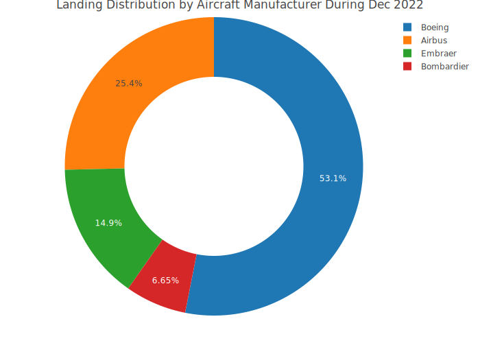

<!-- README.md is generated from README.Rmd. Please edit that file -->

```{r, include = FALSE}
knitr::opts_chunk$set(
  fig.height=5, fig.width=8, 
  message=FALSE, warning=FALSE,
  collapse = TRUE,
  comment = "#>",
  fig.path = "man/figures/README-",
  out.width = "100%"
)
```

# sfo <a href='https://ramikrispin.github.io/sfo/'></a>


```{r, include=FALSE}
library(plotly)
library(dplyr)
library(sfo)
p <- sfo_passengers %>%
  group_by(activity_period) %>%
  summarise(total = sum(passenger_count), .groups = "drop") %>%
  mutate(date = as.Date(paste(substr(activity_period, 1, 4), 
                              substr(activity_period, 5, 6), "01", sep = "/"))) %>%
  plot_ly(x = ~ date, y = ~ total,
          type = "scatter", 
          mode = "lines") %>%
  layout(title = "Monthly Air Traffic Passengers in SFO",
         yaxis = list(title = "Number of Passengers"),
         xaxis = list(title = "Source: San Francisco data portal (DataSF)"))

orca(p, "man/figures/total.svg")  
```

<!-- badges: start -->

[](https://cran.r-project.org/package=sfo) [](https://www.tidyverse.org/lifecycle/#experimental) [](https://opensource.org/licenses/MIT) [](https://github.com/RamiKrispin/sfo/commit/main)

<!-- badges: end -->

The **sfo** package provides summary statistics of the monthly passengers and landing in San Francisco International Airport (SFO).

Data source: San Francisco data portal - [DataSF API](https://datasf.org/opendata/)


## Installation

Install the stable version from CRAN:

``` r
install.packages("sfo")
```

or install the development version from Github:

``` r
# install.packages("devtools")
devtools::install_github("RamiKrispin/sfo", ref = "main")
```

### Datasets

The **sfo** package provides the following two datasets:

* `sfo_passengers` - air traffic passengers statistics
* `sfo_stats` - air traffic landing statistics

More information about the datasets available on the following [vignette](https://ramikrispin.github.io/sfo/articles/v1_intro.html).

### Examples

The `sfo_passengers` dataset provides a monthly summary of the number of passengers in SFO airport by different categories (such as terminal, geo, type, etc.):

```{r }
library(sfo)

data("sfo_passengers")

head(sfo_passengers)
```

The `sfo_stats` dataset provides a monthly statistics on the air traffic landing at SFO airport:

```{r }
data("sfo_stats")

head(sfo_stats)
```

#### Total number of passngers

The total number of passengers in most recent month by `activity_type_code` and `geo_region`:

```{r }
library(dplyr)

sfo_passengers %>%
  filter(activity_period == max(activity_period)) %>%
  group_by(activity_type_code, geo_region) %>%
  summarise(total = sum(passenger_count), .groups = "drop")
```


The `sankey_ly` function enables us to plot the distribution of a numeric variable by multiple categorical variables. The following example shows the distribution of the total United Airlines passengers during 2019 by terminal, travel type (domestic and international), geo, and travel direction (deplaned, enplaned, and transit):

``` r
sfo_passengers %>% 
  filter(operating_airline == "United Airlines",
         activity_period >= 201901 & activity_period < 202001) %>%
  mutate(terminal = ifelse(terminal == "International", "international", terminal)) %>%
  group_by(operating_airline,activity_type_code, geo_summary, geo_region,  terminal) %>%
  summarise(total = sum(passenger_count), .groups = "drop") %>%
  sankey_ly(cat_cols = c("operating_airline", "terminal","geo_summary", "geo_region", "activity_type_code"), 
            num_col = "total",
            title = "Dist. of United Airlines Passengers at SFO During 2019")
```

```{r, include=FALSE}
p <- sfo_passengers %>% 
  filter(operating_airline == "United Airlines",
         activity_period >= 201901 & activity_period < 202001) %>%
  mutate(terminal = ifelse(terminal == "International", "international", terminal)) %>%
  group_by(operating_airline,activity_type_code, geo_summary, geo_region,  terminal) %>%
  summarise(total = sum(passenger_count), .groups = "drop") %>%
  sankey_ly(cat_cols = c("operating_airline", "terminal","geo_summary", "geo_region", "activity_type_code"), 
            num_col = "total",
            title = "Dist. of United Airlines Passengers at SFO During 2019")

orca(p, "man/figures/sankey.svg") 
```


#### Total number of landing

The total number of landing in most recent month by `activity_type_code` and `aircraft_manufacturer`:

``` r
sfo_stats %>% 
  filter(activity_period == max(activity_period),
         aircraft_manufacturer != "") %>%
  group_by(aircraft_manufacturer) %>%
  summarise(total_landing = sum(landing_count),
            `.groups` = "drop") %>%
  arrange(-total_landing) %>%
  plot_ly(labels = ~ aircraft_manufacturer,
          values = ~ total_landing) %>%
  add_pie(hole = 0.6) %>%
  layout(title = "Landing Distribution by Aircraft Manufacturer during Sep 2020")
```


```{r, include=FALSE}
p <- sfo_stats %>% 
  filter(activity_period == max(activity_period),
         aircraft_manufacturer != "") %>%
  group_by(aircraft_manufacturer) %>%
  summarise(total_landing = sum(landing_count),
            `.groups` = "drop") %>%
  arrange(-total_landing) %>%
  plot_ly(labels = ~ aircraft_manufacturer,
          values = ~ total_landing) %>%
  add_pie(hole = 0.6) %>%
  layout(title = "Landing Distribution by Aircraft Manufacturer During Sep 2020")

orca(p, "man/figures/manufacturer.svg") 
```



The following Sankey plot demonstrate the distribution of number of landing in SFO by region and aircraft type, manufacturer, and body type during Sep 2020:

``` r
sfo_stats %>%
  filter(activity_period == max(activity_period)) %>%
  group_by(geo_summary, geo_region, landing_aircraft_type, aircraft_manufacturer, aircraft_body_type) %>%
  summarise(total_landing = sum(landing_count),
  groups = "drop") %>%
  sankey_ly(cat_cols = c("geo_summary", "geo_region", 
                         "landing_aircraft_type", 
                         "aircraft_manufacturer",
                         "aircraft_body_type"),
            num_col = "total_landing",
            title = "Landing Summary by Geo Region and Aircraft Type During Sep 2020")

```


```{r, include=FALSE}
p <- sfo_stats %>%
  filter(activity_period == max(activity_period)) %>%
  group_by(geo_region, landing_aircraft_type, aircraft_manufacturer, aircraft_body_type) %>%
  summarise(total_landing = sum(landing_count),
            groups = "drop") %>%
  sankey_ly(cat_cols = c("geo_region", 
                         "landing_aircraft_type", 
                         "aircraft_manufacturer",
                         "aircraft_body_type"),
            num_col = "total_landing",
            title = "Landing Summary by Geo Region and Aircraft Type During Sep 2020")

orca(p, "man/figures/landing_sankey.svg") 
```


