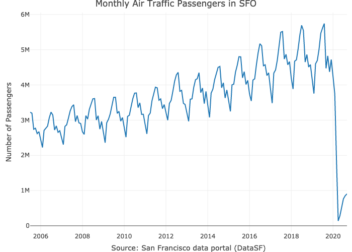
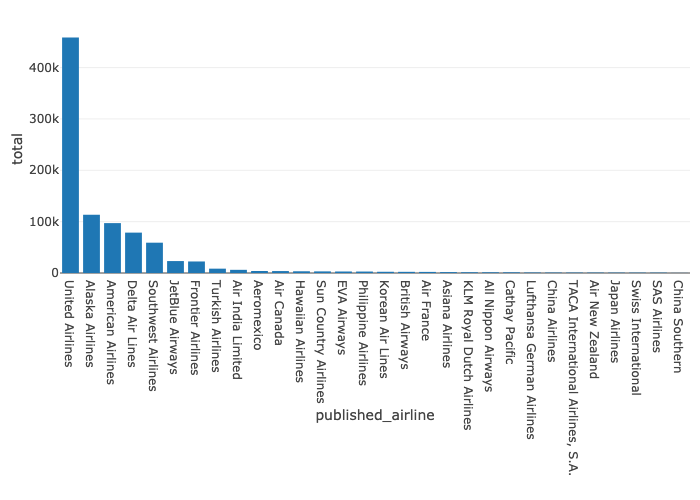

<!-- README.md is generated from README.Rmd. Please edit that file -->

# sfo

 <!-- badges: start -->
<!-- badges: end -->

The **sfo** package provides summary of the monthly passengers in San
Francisco International Airport (SFO).

**Note:** WIP…

## Installation

WIP still not available in CRAN but can be install from Github:

``` r
# install.packages("devtools")
devtools::install_github("RamiKrispin/sfo")
```

## Usage

The `sfo_passengers` dataset provides a monthly summary of the number of
passengers in SFO airport by different categories (such as terminal,
geo, type, etc.):

``` r
library(sfo)

data("sfo_passengers")

head(sfo_passengers)
#>   activity_period operating_airline operating_airline_iata_code published_airline published_airline_iata_code   geo_summary geo_region activity_type_code price_category_code      terminal
#> 1          202009   United Airlines                          UA   United Airlines                          UA International     Mexico           Enplaned               Other    Terminal 3
#> 2          202009   United Airlines                          UA   United Airlines                          UA International     Mexico           Enplaned               Other    Terminal 3
#> 3          202009   United Airlines                          UA   United Airlines                          UA International     Mexico           Enplaned               Other International
#> 4          202009   United Airlines                          UA   United Airlines                          UA International     Mexico           Deplaned               Other International
#> 5          202009   United Airlines                          UA   United Airlines                          UA International     Europe           Enplaned               Other International
#> 6          202009   United Airlines                          UA   United Airlines                          UA International     Europe           Deplaned               Other International
#>   boarding_area passenger_count
#> 1             F            6712
#> 2             E             396
#> 3             G             376
#> 4             G            6817
#> 5             G            3851
#> 6             G            3700
```

Below are some use cases of the package.

### Total number of passngers

The total number of passengers in most recent month by
`activity_type_code` and `geo_region`:

``` r
library(dplyr)

sfo_passengers %>%
  filter(activity_period == max(activity_period)) %>%
  group_by(activity_type_code, geo_region) %>%
  summarise(total = sum(passenger_count), .groups = "drop")
#> # A tibble: 16 x 3
#>    activity_type_code geo_region           total
#>    <chr>              <chr>                <int>
#>  1 Deplaned           Asia                 15775
#>  2 Deplaned           Australia / Oceania   2942
#>  3 Deplaned           Canada                4021
#>  4 Deplaned           Central America        505
#>  5 Deplaned           Europe               12031
#>  6 Deplaned           Mexico               11642
#>  7 Deplaned           Middle East           1490
#>  8 Deplaned           US                  394036
#>  9 Enplaned           Asia                 20123
#> 10 Enplaned           Australia / Oceania   3347
#> 11 Enplaned           Canada                4291
#> 12 Enplaned           Central America        328
#> 13 Enplaned           Europe               12271
#> 14 Enplaned           Mexico               12430
#> 15 Enplaned           Middle East           1176
#> 16 Enplaned           US                  409584
```

Likewise, we can summarize the total number of passengers in most recent
month by airline:

``` r
library(plotly)

sfo_passengers %>%
  filter(activity_period == max(activity_period)) %>%
  group_by(published_airline) %>%
  summarise(total = sum(passenger_count), .groups = "drop") %>%
  arrange(-total) %>%
  mutate(published_airline = factor(published_airline,levels = published_airline)) %>%
  plot_ly(x = ~ published_airline, y = ~ total, type = "bar")
```


