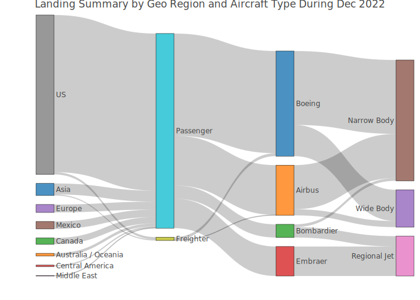

<!-- README.md is generated from README.Rmd. Please edit that file -->

# sfo <a href='https://ramikrispin.github.io/sfo/'></a>

<!-- badges: start -->

[](https://cran.r-project.org/package=sfo)
[](https://lifecycle.r-lib.org/articles/stages.html#stable)
[](https://opensource.org/license/mit/)
[](https://github.com/RamiKrispin/sfo/commit/main)

<!-- badges: end -->

The **sfo** package summarizes the monthly air passengers and landings
at San Francisco International Airport (SFO) between 2005 and 2022. Data
source: San Francisco data portal - [DataSF
API](https://datasf.org/opendata/)


## Installation

Install the stable version from CRAN:

``` r
install.packages("sfo")
```

or install the development version from Github:

``` r
# install.packages("devtools")
devtools::install_github("RamiKrispin/sfo", ref = "main")
```

### Datasets

The **sfo** package provides the following two datasets:

-   `sfo_passengers` - air traffic passengers statistics
-   `sfo_stats` - air traffic landings statistics

More information about the datasets is available in the following
[vignette](https://ramikrispin.github.io/sfo/articles/v1_intro.html).

### Examples

The `sfo_passengers` dataset provides monthly summary of the number of
passengers in SFO airport by different categories (such as terminal,
geo, type, etc.):

``` r
library(sfo)

data("sfo_passengers")

head(sfo_passengers)
#>   activity_period    operating_airline operating_airline_iata_code
#> 1          202212          EVA Airways                          BR
#> 2          202212          EVA Airways                          BR
#> 3          202212             Emirates                          EK
#> 4          202212             Emirates                          EK
#> 5          202212 Flair Airlines, Ltd.                          F8
#> 6          202212 Flair Airlines, Ltd.                          F8
#>      published_airline published_airline_iata_code   geo_summary  geo_region
#> 1          EVA Airways                          BR International        Asia
#> 2          EVA Airways                          BR International        Asia
#> 3             Emirates                          EK International Middle East
#> 4             Emirates                          EK International Middle East
#> 5 Flair Airlines, Ltd.                          F8 International      Canada
#> 6 Flair Airlines, Ltd.                          F8 International      Canada
#>   activity_type_code price_category_code      terminal boarding_area
#> 1           Deplaned               Other International             G
#> 2           Enplaned               Other International             G
#> 3           Deplaned               Other International             A
#> 4           Enplaned               Other International             A
#> 5           Deplaned            Low Fare International             A
#> 6           Enplaned            Low Fare International             A
#>   passenger_count
#> 1           12405
#> 2           15151
#> 3           13131
#> 4           14985
#> 5            2543
#> 6            2883
```

The `sfo_stats` dataset provides monthly statistics on the air traffic
landing at SFO airport:

``` r
data("sfo_stats")

head(sfo_stats)
#>   activity_period operating_airline operating_airline_iata_code
#> 1          202212        Air Canada                          AC
#> 2          202212   Delta Air Lines                          DL
#> 3          202212   Delta Air Lines                          DL
#> 4          202212  WestJet Airlines                          WS
#> 5          202212  WestJet Airlines                          WS
#> 6          202212  WestJet Airlines                          WS
#>   published_airline published_airline_iata_code   geo_summary geo_region
#> 1        Air Canada                          AC International     Canada
#> 2   Delta Air Lines                          DL      Domestic         US
#> 3   Delta Air Lines                          DL      Domestic         US
#> 4  WestJet Airlines                          WS International     Canada
#> 5  WestJet Airlines                          WS International     Canada
#> 6  WestJet Airlines                          WS International     Canada
#>   landing_aircraft_type aircraft_body_type aircraft_manufacturer aircraft_model
#> 1             Passenger          Wide Body                Boeing           B773
#> 2             Passenger        Narrow Body                Airbus           A319
#> 3             Passenger        Narrow Body                Airbus           A320
#> 4             Passenger        Narrow Body                Boeing           B38M
#> 5             Passenger        Narrow Body                Boeing           B737
#> 6             Passenger        Narrow Body                Boeing           B738
#>   aircraft_version landing_count total_landed_weight
#> 1                -             1              554000
#> 2                -           163            22459444
#> 3                -            43             6114514
#> 4                -             5              764000
#> 5                -             5              646000
#> 6                -             3              438900
```

#### Total number of passngers

The total number of passengers in most recent month by
`activity_type_code` and `geo_region`:

``` r
library(dplyr)

sfo_passengers %>%
  filter(activity_period == max(activity_period)) %>%
  group_by(activity_type_code, geo_region) %>%
  summarise(total = sum(passenger_count), .groups = "drop")
#> # A tibble: 19 × 3
#>    activity_type_code geo_region            total
#>    <chr>              <chr>                 <int>
#>  1 Deplaned           Asia                 147461
#>  2 Deplaned           Australia / Oceania   45950
#>  3 Deplaned           Canada                53237
#>  4 Deplaned           Central America       12749
#>  5 Deplaned           Europe               124301
#>  6 Deplaned           Mexico                64121
#>  7 Deplaned           Middle East           28921
#>  8 Deplaned           US                  1353634
#>  9 Enplaned           Asia                 166684
#> 10 Enplaned           Australia / Oceania   44286
#> 11 Enplaned           Canada                57280
#> 12 Enplaned           Central America       15475
#> 13 Enplaned           Europe               135635
#> 14 Enplaned           Mexico                73971
#> 15 Enplaned           Middle East           31446
#> 16 Enplaned           US                  1382565
#> 17 Thru / Transit     Australia / Oceania    2817
#> 18 Thru / Transit     Europe                 2496
#> 19 Thru / Transit     US                     3129
```

The `sankey_ly` function enables us to plot the distribution of a
numeric variable by multiple categorical variables. The following
example shows the distribution of the total United Airlines passengers
during 2019 by a terminal, travel type (domestic and international),
geo, and travel direction (deplaned, enplaned, and transit):

``` r
sfo_passengers %>% 
  filter(operating_airline == "United Airlines",
         activity_period >= 201901 & activity_period < 202001) %>%
  mutate(terminal = ifelse(terminal == "International", "international", terminal)) %>%
  group_by(operating_airline,activity_type_code, geo_summary, geo_region,  terminal) %>%
  summarise(total = sum(passenger_count), .groups = "drop") %>%
  sankey_ly(cat_cols = c("operating_airline", "terminal","geo_summary", "geo_region", "activity_type_code"), 
            num_col = "total",
            title = "Dist. of United Airlines Passengers at SFO During 2019")
```


#### Total number of landing

The total number of landings during the most recent month by
`activity_type_code` and `aircraft_manufacturer`:

``` r
sfo_stats %>% 
  filter(activity_period == 202212,
         aircraft_manufacturer != "") %>%
  group_by(aircraft_manufacturer) %>%
  summarise(total_landing = sum(landing_count),
            `.groups` = "drop") %>%
  arrange(-total_landing) %>%
  plot_ly(labels = ~ aircraft_manufacturer,
          values = ~ total_landing) %>%
  add_pie(hole = 0.6) %>%
  layout(title = "Landing Distribution by Aircraft Manufacturer during Dec 2022")
```


The following Sankey plot demonstrates the distribution of the number of
landing in SFO by region and aircraft type, manufacturer, and body type
during Dec 2022:

``` r
sfo_stats %>%
  filter(activity_period == 202212) %>%
  group_by(geo_summary, geo_region, landing_aircraft_type, aircraft_manufacturer, aircraft_body_type) %>%
  summarise(total_landing = sum(landing_count),
  groups = "drop") %>%
  sankey_ly(cat_cols = c("geo_summary", "geo_region", 
                         "landing_aircraft_type", 
                         "aircraft_manufacturer",
                         "aircraft_body_type"),
            num_col = "total_landing",
            title = "Landing Summary by Geo Region and Aircraft Type During Dec 2022")
```


